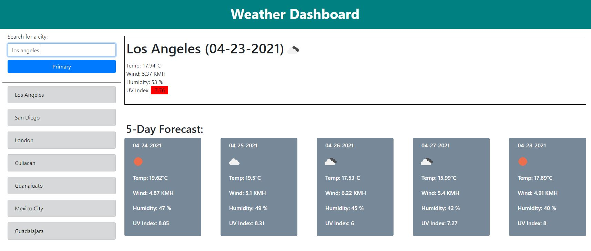

# Weather-Dashboard

The purpose of this activity was to implement different frameworks along with third party and server side APIs in order to develop a simple webpage that displays weather information regarding the inquired city.

The task consisted in building a webpage from zero, we had to retrieve information from a server side API and stored previously browsed cities in local storage. This task was completed designing a basic HTML file to later manipulate the DOM with javascript in order to build a webpage that displayed information regarding an specific city when demanded.

## When the webpage is displayed, then:
* The user can see the previously browsed elements on the left side of the screen
* When the user clicks on these elements, they can see the weather, humidity, wind speed and UV Index or that specific city
* When the user inputs or clicks a city, today's weather as well as the next 5 days information is displayed
* The UV Index for today's weather section change of color depending on how high its value is

After implementing all of the previous requirements, we were supposed to have a webpage that works as a fully functional weather dashboard

## Technologies

This project was developed using:
* CSS3
* HTML5
* JavaScript
* Bootstrap
* MomentJS
* One Call API

## Setup

To run this project clone this repository in a folder and open the html file, there is also a deployed webpage that shows the final version of the project, you can access it by opening the link at the end of this file

## Development process

This activity consisted in implementing server side APIs in order to build a wether dashboard. This task was achieved by doing the following 

* Splitting the webpage into two columns, the left and mid-right side of the screen
* The left side of the screen takes around 20% of the screen
* It has the form that retrieves the city name that the user wants to search
* It also holds the previous browsed cities, these cities are locally stored
* The right side of the screen takes around 78% of the screen
* It displays today's weather information on the top side of the screen
* It also displays the weather information of the next 5 days in small cards, this section is played right under today's weather information

| | 
| ------------- |
| Final weather dashboard |

For further information, please read the comments on each file, in order to test the final product, you can either download the repository and execute the indel.html file or simply click on the URL at the end of this file to acces the deployed webpage.

&nbsp;

## Deployed webpage:
* https://erickcc.github.io/Weather-Dashboard/